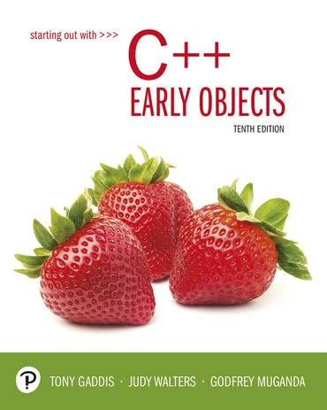

<link rel="stylesheet" href="./assets/styles.css">

<table class="book-grid">
<tr>
<td></td>
<td></td>
<td></td>
<td></td>
</tr>
<tr>
<td></td>
<td></td>
<td></td>
<td></td>
</tr>
<tr>
<td></td>
<td></td>
<td></td>
<td></td>
</tr>
</table>

---

### FIRST CODING PROJECT 🕹️

#### Late Night. Don't Become Takeout.

**Stop the falling orders before they hit the ground.**

### [CLICK TO PLAY THE GAME!](https://scratch.mit.edu/projects/382209881/)
